## Table of Contents

1. [Project Goals](#project-goals)
    1. [User Goals](#user-goals)
    2. [Site Owner Goals](#site-owner-goals)
2. [User Experience](#user-experience)
    1. [Targeted Audience](#targeted-audience)
    2. [User Requirements and Expectations](#user-requirements-and-expectations)
    3. [User Stories](#user-stories)
3. [Design](#design)
    1. [Design Choices](#design-choices)
    2. [Color](#color)
    3. [Fonts](#fonts)
    4. [Structure](#structure)
    5. [Wireframes](#wireframes)
4. [Technologies Used](#technologies-used)
    1. [Languages](#languages)
    2. [Frameworks and Tools](#frameworks-and-tools)
5. [Features](#features)
6. [Testing](#validation)
7. [Bugs](#Bugs)
8. [Deployment](#deployment)
9. [Credits](#credits)
10. [Acknowledgements](#acknowledgements)

# Sean's Games
(Developer: Sean Reid)

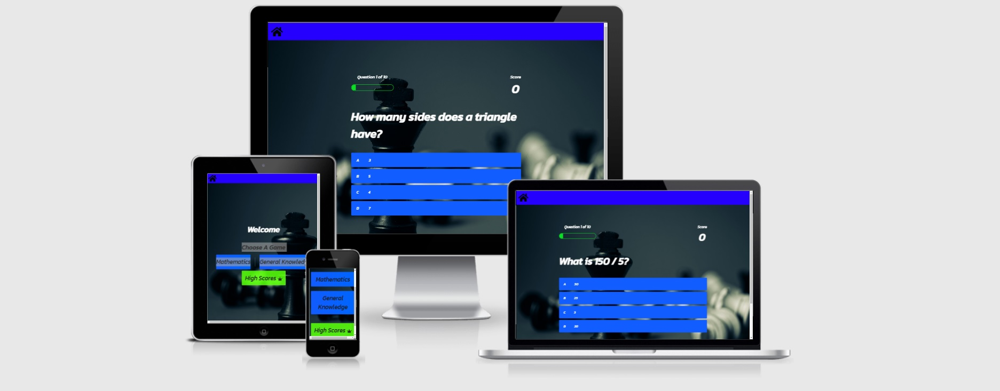
<a href="https://seanreid1997.github.io/code-institute-p2/">Live Website</a>

## Project Goals

### User Goals
<ul>
<li>To find a fun little quiz to play.</li>
<li>To play a game that is interactive.</li>
<li>To see random questions rather than repetitive ones.</li>
</ul>

### Site Owner Goals
<ul>
<li>To provide users with a fun little quiz game.</li>
<li>To provide a leaderboard for scores to be recorded.</li>
<li>Website should be interactive and appealing.</li>
<li>Users to be able to login/Sign up.</li>
<li>Pages should be responsive.</li>
</ul>

## User Experience

### Targeted Audience
<ul>
<li>Users interested in playing a quick fun quiz.</li>
<li>Users looking to get a little general knowledge.</li>
</ul>

### User Requirements and Expectations
<ul>
<li>All appropriate links are working correctly.</li>
<li>A simple navigation.</li>
<li>Answers to be correct.</li>
</ul>

### User Stories

#### As A User
1. I expect to be able to play a fun game and maybe learn a little.
2. I want to be able to leave feedback.
3. I want to be able to play on different devices.
4. I want to be able to see/join a leaderboard.
5. I expect the questions to be random.
6. I want to know how far I am into a game.
7. I want the correct answers to be accurate.
8. I want to know my score.

#### As A Site Owner
9. I want to provide a leaderboard for users.
10. I want users to have a little fun.
11. I want the website to be interactive.
12. I want all pages and links to work properly.
13. I want the website to be responsive.
14. I want users to return from 404 page without using browser back button.
15. I want users to be able return to home at any point.

## Design

### Design Choices
While learning how to make a quiz from the Brian Design youtube channel, I liked the design he showed us and the color schemes as well. I kept the blue color for the buttons but decided i wanted a lighter page so I changed the background color to White and the made the headings black instead.

### Fonts
The fonts I used for this project taken from Google fonts.

### Structure
Including the youtube tutorial i looked around at examples of different quiz formats and I decided to keep the standard way of structuring questions and choices for answers.

### Wireframes

Home

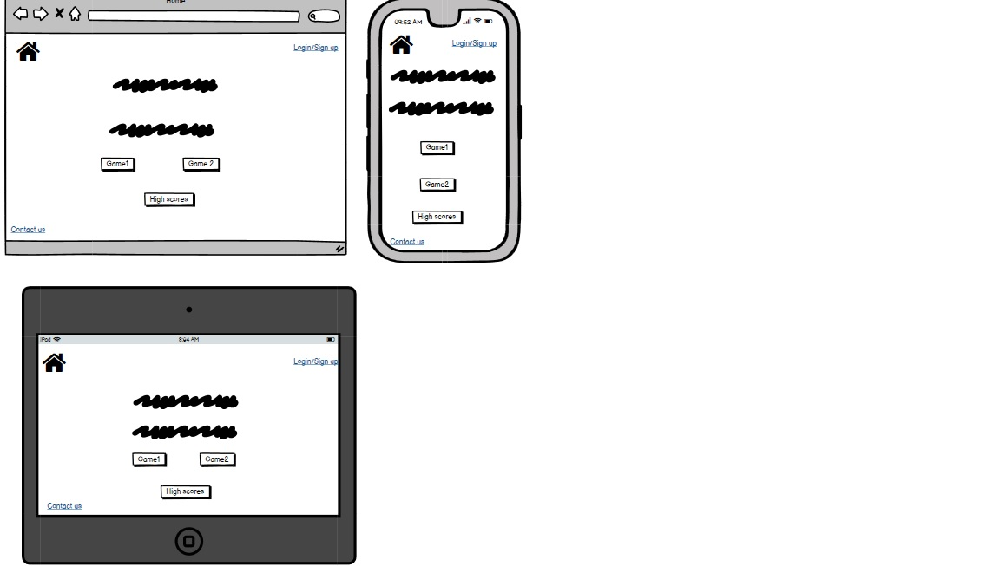

Maths

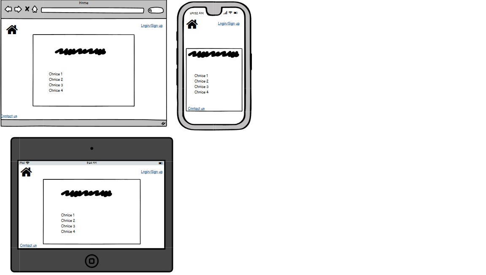

General Knowledge

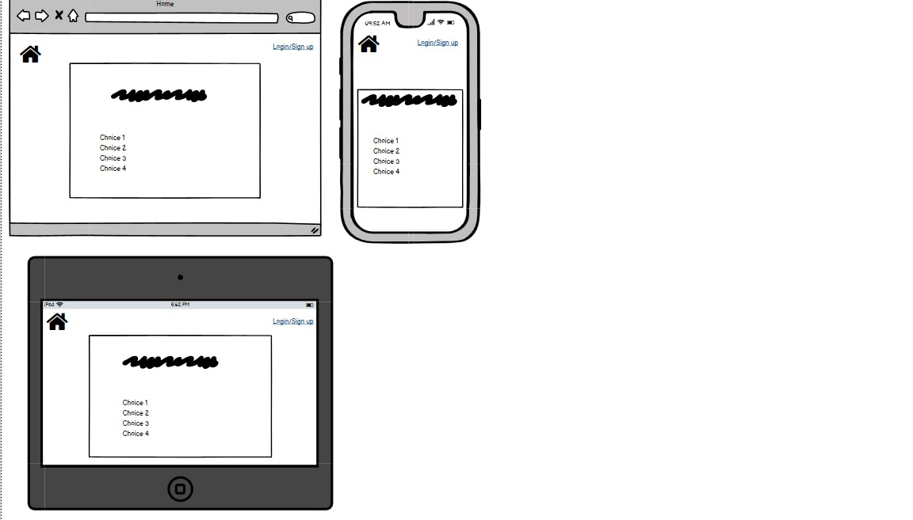

Summary

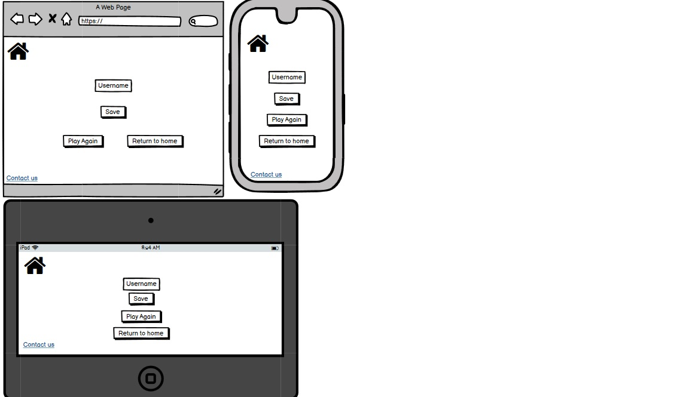

404

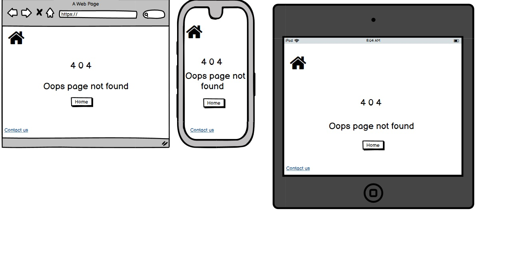

Leaderboard

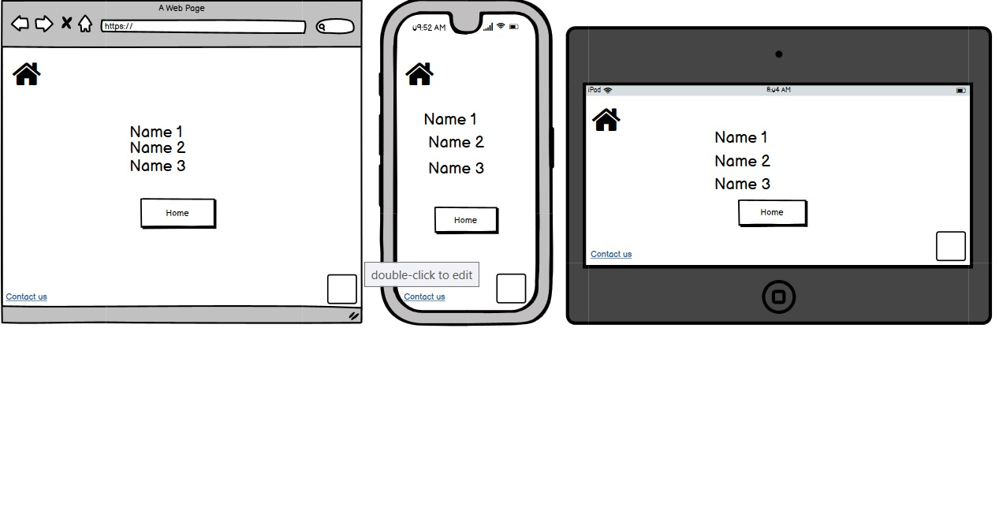

## Technologies Used

### Languages
<ul>
<li>HTML</li>
<li>CSS</li>
<li>Javascript</li>
</ul>

### Frameworks and Tools
<ul>
<li>Balsamiq</li>
<li>FontAwesome</li>
<li>Git</li>
<li>Github</li>
<li>Gitpod</li>
<li>Google Fonts</li>
<li>Windows Paint App</li>
</ul>

## Features

### Home Page
<ul>
<li>The<strong>Home</strong>page has a very simple structure.</li>
<li>At the top is a navigation bar consisting of a home icon for users to return.</li>
<li>The body of the page consists of a welcome message and three buttons.</li>
<li>These three buttons are links to both quizes and the leaderboard.</li>
</ul>
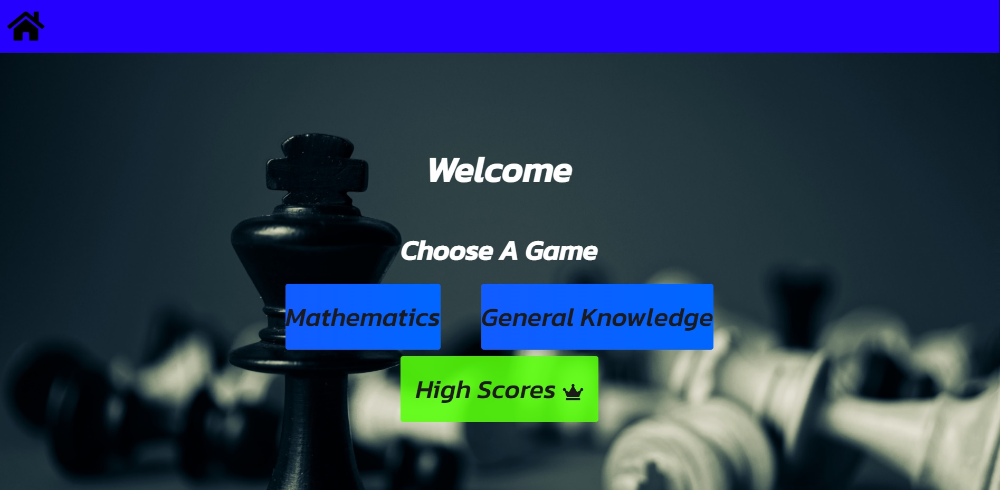

### Mathematics Quiz
<ul>
<li>The math  quiz follows a standard way of displaying a question.</li>
<li>It consists of a progress bar and a score tracker at the top</li>
<li>Below the progress bar is the question and beneath that are the options(choices) for the users answer.</li>
</ul>

### General Knowledge Quiz
<ul>
<li>The general knowledge quiz is structured in the same way as the maths quiz.</li>
<li>It consists of a progress bar, score tracker, a question and 4 options for answers.</li>
</ul>

### Summary Page

### Leaderboard page

### 404 page
<ul>
<li>The 404 page consists follows the same design as the rest of the website.</li>
<li>It consists of an error message and a button to return home without using browser back button.</li>
</ul>

### footer
<ul>
<li>At the bottom of every page is a footer.</li>
<li>Within this footer are links to social media and a contact us page.</li>
</ul>
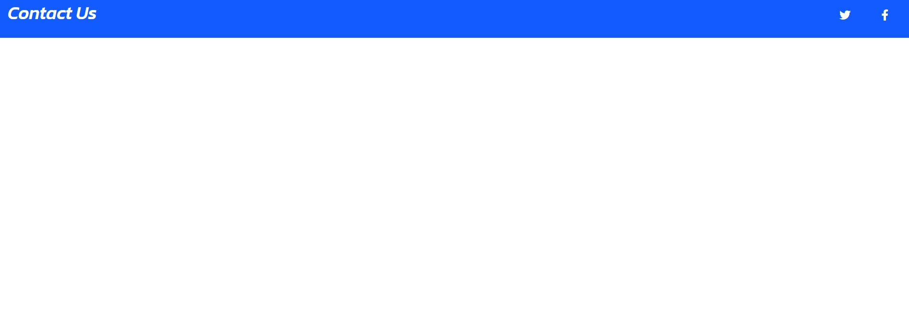

### Contact page
<ul>
<li>On the contact page is a simple form for anyone to leave feedback.</li>
</ul>
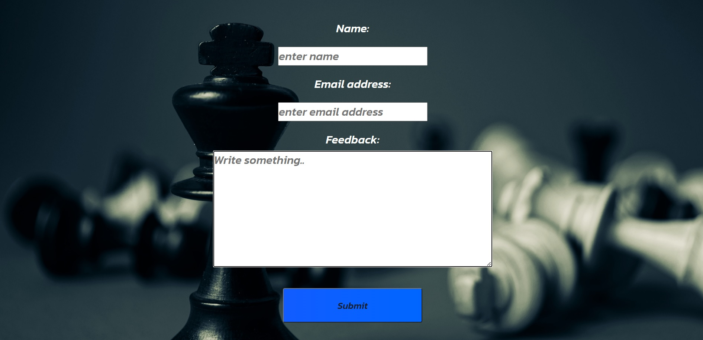

## Testing

### Validation

#### HTML
Html was validated via The WC3 Markup Validation Service.

Home

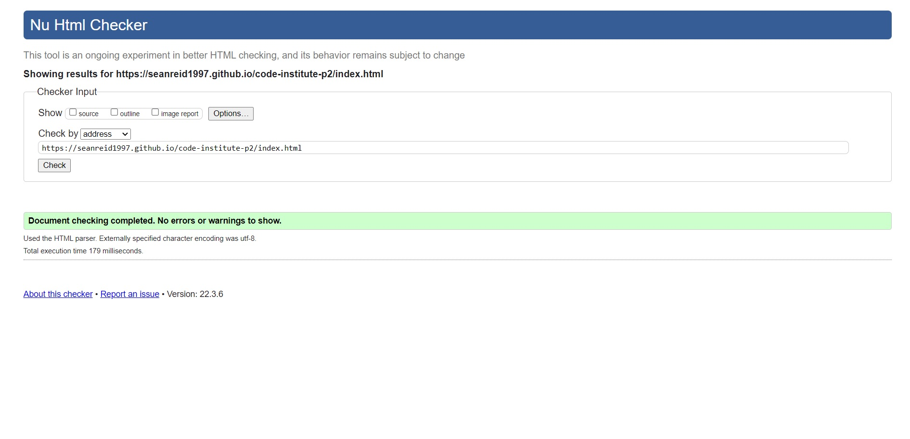

Maths Quiz

Gallery

404

### CSS

Css was validated via The WC3 CSS Validation Service.

Css

### Javascript
Javascript was validated via JSHint JavaScript Validator

Css

### Accessablility

Accessibility was tested via The Wave Web Accessibility Evaluation Tool

Home

History

Gallery

404

### Performance

Performance was tested via Lighthouse from Google Dev Tools

Home

History

Gallery

### Device Testing

#### Browser Compatibility
The website was tested on the browsers listed below:
<ul>
<li>Google Chrome</li>
<li>Microsoft Edge</li>
<li>Firefox</li>
</ul>

### Testing User Stories

1. I expect to be able to play a fun game and maybe learn a little.

| **Feature** | **Action** | **Expected Result** | **Actual Result** |
|-------------|------------|---------------------|-------------------|
| Webpages | View website | To be neat | Works as expected |

Screenshots

2. I want to be able to Login or Sign up.

| **Feature** | **Action** | **Expected Result** | **Actual Result** |
|-------------|------------|---------------------|-------------------|
| Webpages | View website | To be neat | Works as expected |

Screenshots

3. I want to be able to play on different devices.

| **Feature** | **Action** | **Expected Result** | **Actual Result** |
|-------------|------------|---------------------|-------------------|
| Webpages | View website | To be neat | Works as expected |

Screenshots

4. I want to be able to see/join a leaderboard.

| **Feature** | **Action** | **Expected Result** | **Actual Result** |
|-------------|------------|---------------------|-------------------|
| Webpages | View website | To be neat | Works as expected |

Screenshots

5. I expect the questions to be random.

| **Feature** | **Action** | **Expected Result** | **Actual Result** |
|-------------|------------|---------------------|-------------------|
| Webpages | View website | To be neat | Works as expected |

Screenshots

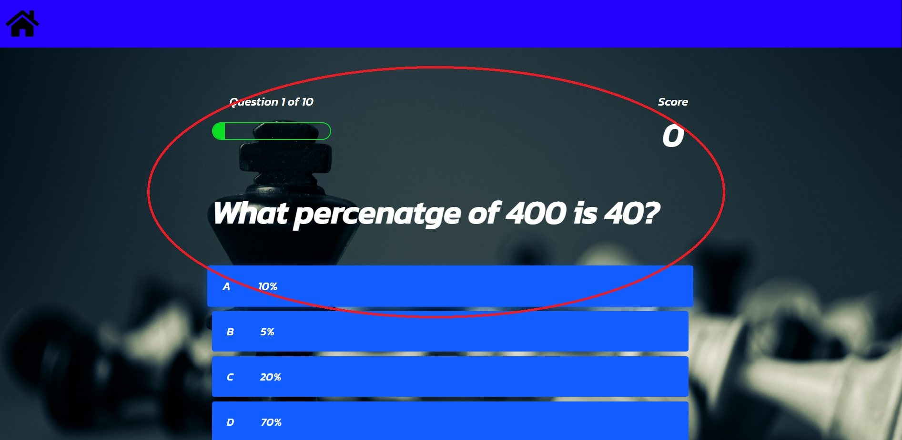

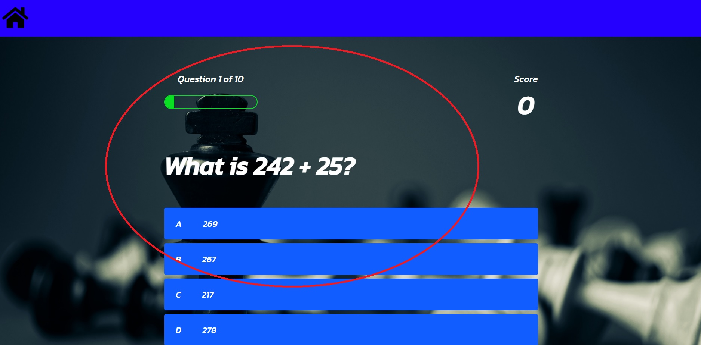

6. I want to know how far I am into a game.

| **Feature** | **Action** | **Expected Result** | **Actual Result** |
|-------------|------------|---------------------|-------------------|
| Webpages | View website | To be neat | Works as expected |

Screenshots

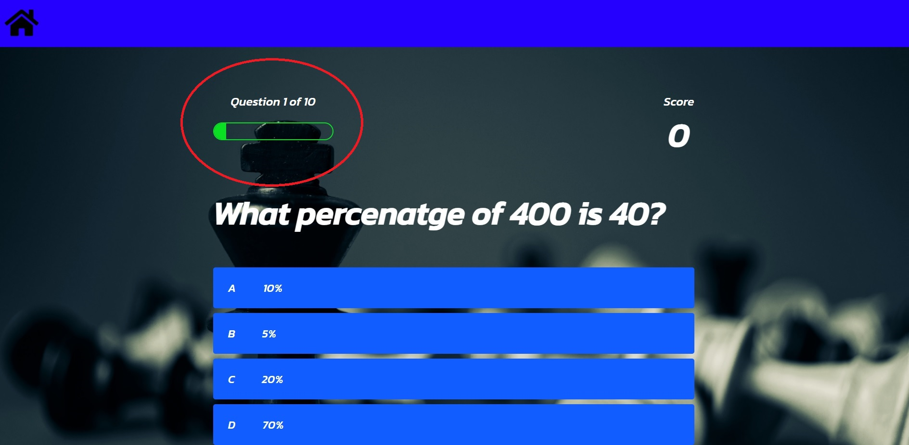

7. I want the correct answers to be accurate.

| **Feature** | **Action** | **Expected Result** | **Actual Result** |
|-------------|------------|---------------------|-------------------|
| Webpages | View website | To be neat | Works as expected |

Screenshots

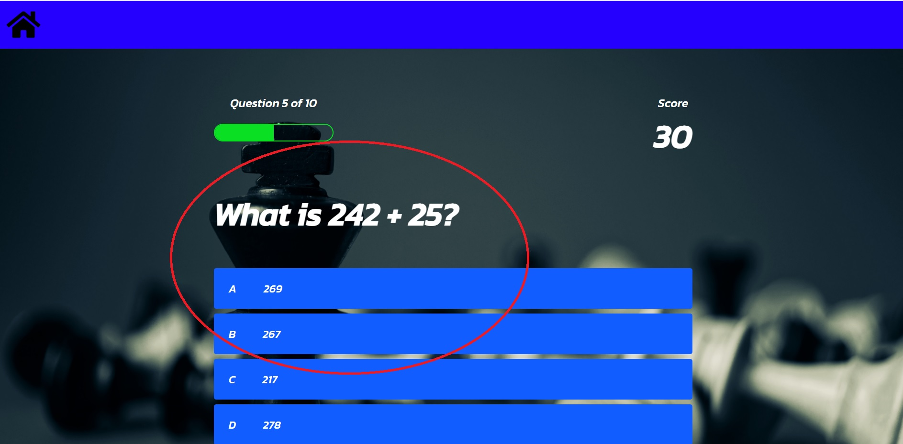

8. I want to know my score.

| **Feature** | **Action** | **Expected Result** | **Actual Result** |
|-------------|------------|---------------------|-------------------|
| Webpages | View website | To be neat | Works as expected |

Screenshots

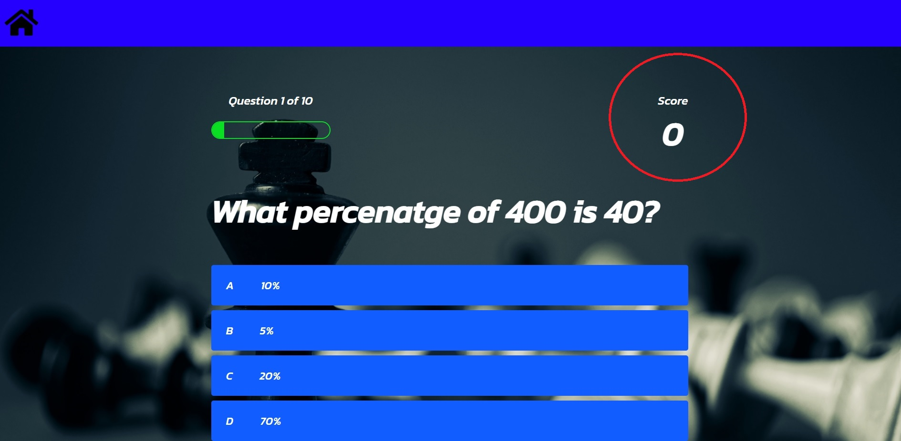

9. I want to provide a leaderboard for users.

| **Feature** | **Action** | **Expected Result** | **Actual Result** |
|-------------|------------|---------------------|-------------------|
| Webpages | View website | To be neat | Works as expected |

Screenshots

10. I want users to have a little fun.

| **Feature** | **Action** | **Expected Result** | **Actual Result** |
|-------------|------------|---------------------|-------------------|
| Webpages | View website | To be neat | Works as expected |

Screenshots

11. I want the website to be interactive.

| **Feature** | **Action** | **Expected Result** | **Actual Result** |
|-------------|------------|---------------------|-------------------|
| Webpages | View website | To be neat | Works as expected |

Screenshots

12. I want all pages and links to work properly.

| **Feature** | **Action** | **Expected Result** | **Actual Result** |
|-------------|------------|---------------------|-------------------|
| Webpages | View website | To be neat | Works as expected |

Screenshots

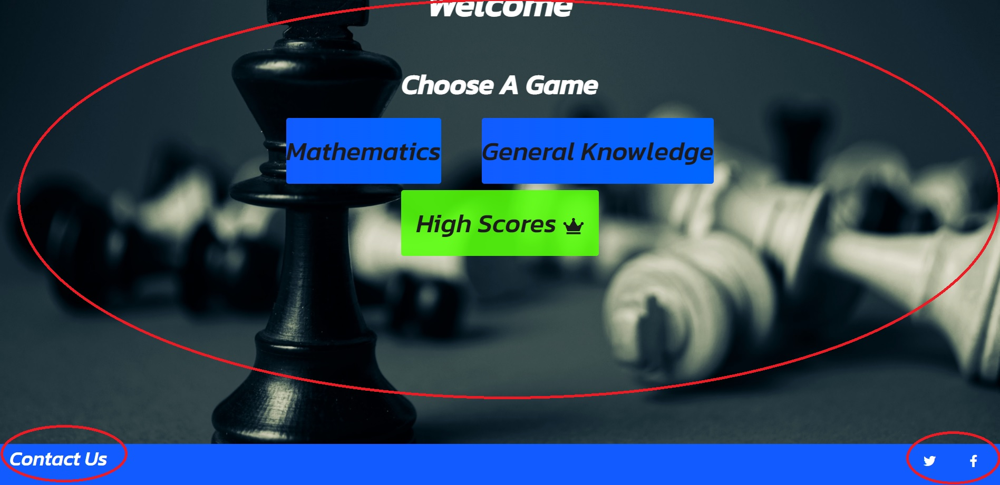

13. I want the website to be responsive.

| **Feature** | **Action** | **Expected Result** | **Actual Result** |
|-------------|------------|---------------------|-------------------|
| Webpages | View website | To be neat | Works as expected |

Screenshots

14. I want users to return from 404 page without using browser back button.

| **Feature** | **Action** | **Expected Result** | **Actual Result** |
|-------------|------------|---------------------|-------------------|
| Webpages | View website | To be neat | Works as expected |

Screenshots

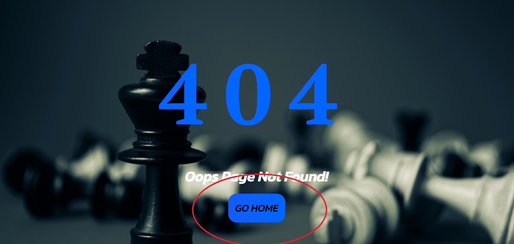

15. I want users to be able return to home at any point.

| **Feature** | **Action** | **Expected Result** | **Actual Result** |
|-------------|------------|---------------------|-------------------|
| Webpages | View website | To be neat | Works as expected |

Screenshots

## Bugs

| **Bugs** | **Fixes** |
| -------- | --------- |
| The iframe for the map had an error of "google.com refused to connect". | Replace map with embedded map.
| Accessibilty validation revealed a contrast error with level 1 heading. | Change h1 to darker color.
| Html validation check revealed a warning to give nav section a heading. | Change section elements to divs.

## Unfixed Bugs
<ul>
<li>Bcakground image won't work unless it is directly input into the body element in the html file.</li>
</ul>

## Deployment

### Github Pages

The site was deployed to GitHub Pages via the following steps:
<ul>
<li>Within the GitHub repository, navigate to the Settings tab.</li>
<li>In the menu on the left select Pages.</li>
<li>From the Source Branch menu seclect Main and save.</li>
<li>Once complete the page will provide a link to deployed website.</li>
<li>After a few minutes, refrsh the page and the site will be ready.</li>
</ul>

## Credits

### Code Institute

<ul>
<li>The template used for this website was the CI template from Code Institute.</li>
</ul>

### Content
<ul>
<li>The main structure of the website was taken from a youtube tutorial made on the Brian Design channel. <a href="https://www.youtube.com/watch?v=f4fB9Xg2JEY">Brian Design.</a></li>
<li>The format for my README.md was inspired by Developer Ana Runje.</li>
<li>All icons used were taken from the Font Awesome Website.</li>
<li>Background image was a Photo by George Becker from <a href="https://www.pexels.com/photo/kick-chess-piece-standing-131616/">Pexels.com</a></li>
</ul>

### Media

### Acknowledgements
<ul>
<li>I would like to thank my mentor Mo Shami for once again guiding me through this project as much as he could despite a tight time frame.</li>
<li>I would like to thank the Code Institute student care team for the continued support.</li>
<li>I would like to thank Youtuber Brian from Brian Design for posting a tutorial on how to make a quiz via javascript.</li>
</ul>

